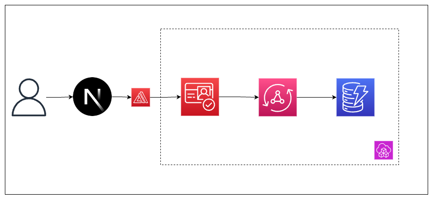
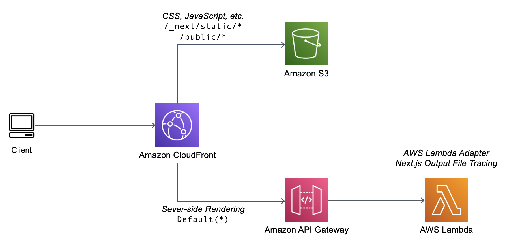

# Amplify - NextJs14 - Appsync - Cognito - DynamoDB Starter Template

The frontend stack is comprised of the following main pieces:

- **NextJS 14**: At the time of this commit, I'm still learning the basics of the app directory and RSC's in general. Primarily around cacheing.

- **Tailwind CSS**: I use this for the layout and for basic styling. I'm not very good at it, but with so many component libraries not offering much compatability with RSC's this is a great option.

- **DaisyUI**: This component library makes working with Tailwind much easier and time effective. Not only is this used for the visual appeal, but it's what I used to implement a **dark mode toggle**.

- **AWS Amplify JS libraries and Connected Components**: Connecting my frontend to my backend is done relatively simply through the use of Amplify's libraries. They've updated to `v6` recently to allow API's to be called on the client and server. I also use their `Authenticator` component to provide a simple and pre-built auth flow.

## Setup

1. **Install the dependencies**

```sh
cd _backend && npm i && cd .. && npm i
```

2. **Update the `cdk.context.json` values**: Probably the most important step. These values need to correspond to your project details.
3. Note that if you change the appName, you'll also want to change the `awsconfig.ts` frontend file to match as well. It follows an `${appName}-${stage}-Stack` convention. Also the value for `ghTokenName` is the name of the key stored in AWS Secrets Manager.
4. When deployment directly with `cdk`, you must use either `main` or `dev` branches
5. Push a commit to GitHub and check the build in the Amplify Hosting console.

### The Backend Stack



- **Amazon Cognito**: This is the authentication and authorization piece of the application. This service is made up of 3 core parts:

  1. **Userpool**: This defines how our users login/signup and as the name suggests, ends up containing all of our users.
  2. **Identity Pool**: If a userpool is used to authenticate, then an identity pool is used for authorization. This provides the `roles` (set of permissions) that our authenticated and unauthenticated users can do.
  3. **Web Client**: There are many ways to sign up. It could be a web app, an IoT device, a server, etc. This simply tells Cognito we are authenticating on the web.

### Deployment

- **CDK Context**: This JSON file contains all of my dynamic variables such as the app name, and account number of the account I want to deploy to.
- **Git Branch**: This simple NPM package is used locally for building and deploying changes. It matches the current git branch with the corresponding config object in the CDK Context file.
- **Amplify Hosting**: This alpha L2 construct uses the CDK Context file to find the account and region information to deploy our backend resources to. Because an Amplify Hosting environment doesn't use Git (it uses Code Deploy), there isn't a `git-branch` available. Instead is uses a `$AWS_BRANCH` variable.

## Pros, Cons and Alternatives

1. Pros

- Using Amplify WEB_COMPUTE, both ISG(Incremental Static Generation), SSG(Static Side Generation) and SSR(Server-side rendering) are supported out of the box, at cheaper price, compared to Vercel.
- CDK Approach, with Amplify hooking up to Github Repo

2. Cons

- Using Amplify WEB_COMPUTE, we do not have any control over performance of WEB_COMPUTE, unlike AWS Lambda or ECS, where will can optimize performance.
- Using AppSync may help simplify the separation between FE and BE, but it add cold-start for using BE Lambdas. We are losing all performance optimization, when dealing with API and datasources directly within NextJS.
- It may not be easy to access VPC private resources through WEB_COMPUTE, as it may not be possible to add it into a VPC

3. Alternative 1 (best performance)

- OpenNext SST deployment v2 (using CDK) or v3 (not using CDK)
- [cdk-nextjs](https://github.com/jetbridge/cdk-nextjs), which helps running NextJS on Lambda, fronted by Cloudfront. With this approach, we have both BE and FE integrated in 1 package. This would optimize NextJS caching and performance, while reducing `cold-start` for having separate BE.
- For Authentication and Authorization, we can use `middleware.ts` inside NextJS to `fetchUserSession` and protecting routes, through Amplify Connected Liraries
- A Better Authentication/Authorization approaches, are to use Lambda@Edge to secure access to the all Core Lambdas behind Cloudfront. Refering to `Authenticator` method inside [cognito-at-edge](https://github.com/awslabs/cognito-at-edge)


4. Alternative 2 (Simplest)

- Another simpler Alternative are using `Lambda Web Adapter` with proper docker image. [Template here](https://github.com/thangtran3112/aws-next/tree/main/aws-lambda-nextjs)



## References

- [youtube video](https://www.youtube.com/watch?v=6-Z7xJCp-Zw&t=423s) that covers most of this in a separate app!
